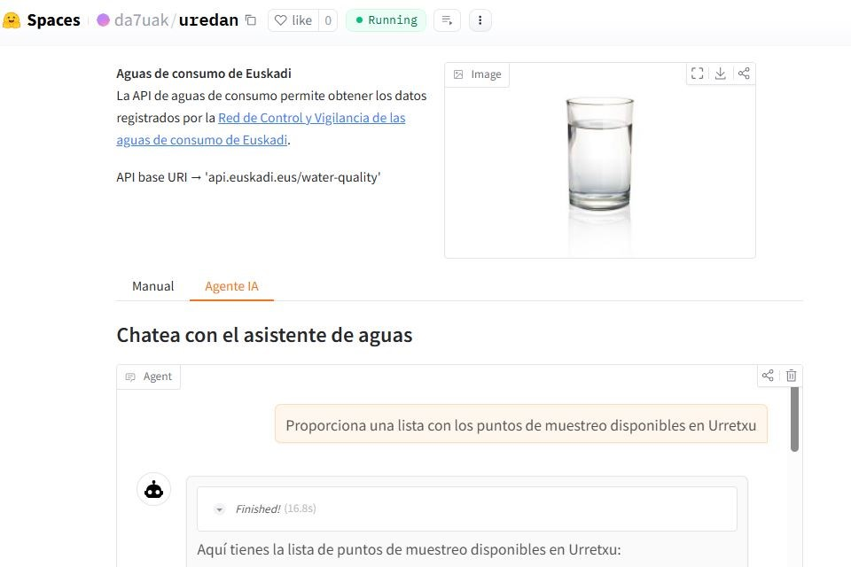

# uredan

## AI agent for water quality API

__Aguas de consumo de Euskadi__  
La API de aguas de consumo permite obtener los datos registrados por la [Red de Control y Vigilancia de las aguas de consumo de Euskadi](https://www.euskadi.eus/informacion/red-de-control-y-vigilancia-de-las-aguas-de-consumo-de-euskadi/web01-a3aguas/es/).(API base URI → 'api.euskadi.eus/water-quality')

## APP

https://huggingface.co/spaces/da7uak/uredan

